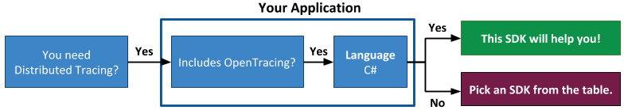

# wavefront-opentracing-sdk-csharp [](http://opentracing.io) [](https://travis-ci.com/wavefrontHQ/wavefront-opentracing-sdk-csharp) [](https://www.nuget.org/packages/Wavefront.OpenTracing.SDK.CSharp)

## Table of Content
* [Requirements and Installation](#Requirements-and-Installation)
* [Usage](#Usage)
  * [Application Tags](#1-Set-Up-Application-Tags)
  * [WavefrontSender](#2-Set-Up-a-WavefrontSender)
  * [Reporter](#3-Set-Up-a-Reporter)
  * [WavefrontTracer](#4-Create-a-WavefrontTracer)
* [Span Logs](#Span-Logs)
* [Cross Process Context Propagation](#Cross-Process-Context-Propagation)
* [RED Metrics](#RED-Metrics)
* [Monitoring the SDK](#Monitoring-the-SDK)
* [License](#License)
* [How to Contribute](#How-to-Contribute)

# Welcome to Wavefront's OpenTracing C# SDK

This is the Wavefront by VMware OpenTracing SDK for C# that provides distributed tracing support for Wavefront.

**Before you start implementing, let us make sure you are using the correct SDK!**



>  <b><i>Note</i></b>:
> </br>
>  * <b>This is the Wavefront by VMware OpenTracing SDK for c#!</b>
> If this SDK is not what you were looking for, see the <a href="#wavefront-sdks">table</a> given below.
> * See <a href="https://docs.wavefront.com/tracing_instrumenting_frameworks.html">instrument your application for tracing</a> for more information.

#### Wavefront SDKs
<table id="SDKlevels" style="width: 100%">
  <tr>
    <th width="10%">SDK Type</th>
    <th width="45%">SDK Description</th>
    <th width="45%">Supported Languages</th>
  </tr>
  <tr>
    <td><a href="https://docs.wavefront.com/wavefront_sdks.html#sdks-for-collecting-trace-data">OpenTracing SDK</a></td>
    <td align="justify">Implements the OpenTracing specification. Lets you define, collect, and report custom trace data from any part of your application code. <br>Automatically derives RED metrics from the reported spans. </td> 
    <td>
    <ul>
    <li>
      <b>Java</b>: <a href ="https://github.com/wavefrontHQ/wavefront-opentracing-sdk-java">OpenTracing SDK</a> <b>|</b> <a href ="https://github.com/wavefrontHQ/wavefront-opentracing-bundle-java">Tracing Agent</a>
    </li>
    <li>
      <b>Python</b>: <a href ="https://github.com/wavefrontHQ/wavefront-opentracing-sdk-python">OpenTracing SDK</a>
    </li>
    <li>
      <b>Go</b>: <a href ="https://github.com/wavefrontHQ/wavefront-opentracing-sdk-go">OpenTracing SDK</a>
    </li>
    <li>
      <b>.Net/C#</b>: <a href ="https://github.com/wavefrontHQ/wavefront-opentracing-sdk-csharp">OpenTracing SDK</a>
    </li>
    </ul>
    </td>
  </tr>

  <tr>
    <td><a href="https://docs.wavefront.com/wavefront_sdks.html#sdks-for-collecting-metrics-and-histograms">Metrics SDK</a></td>
    <td align="justify">Implements a standard metrics library. Lets you define, collect, and report custom business metrics and histograms from any part of your application code.   </td> 
    <td>
      <ul>
      <li>
      <b>Java</b>: <a href ="https://github.com/wavefrontHQ/wavefront-dropwizard-metrics-sdk-java">Dropwizard</a> <b>|</b> <a href ="https://github.com/wavefrontHQ/wavefront-runtime-sdk-jvm">JVM</a>
      </li>
      <li>
      <b>Python</b>: <a href ="https://github.com/wavefrontHQ/wavefront-pyformance">Pyformance SDK</a>
      </li>
      <li>
      <b>Go</b>: <a href ="https://github.com/wavefrontHQ/go-metrics-wavefront">Go Metrics SDK</a>
      </li>
      <li>
      <b>.Net/C#</b>: <a href ="https://github.com/wavefrontHQ/wavefront-appmetrics-sdk-csharp">App Metrics SDK</a>
      </li>
      </ul>
    </td>
  </tr>

  <tr>
    <td><a href="https://docs.wavefront.com/wavefront_sdks.html#sdks-that-instrument-frameworks">Framework SDK</a></td>
    <td align="justify">Reports predefined traces, metrics, and histograms from the APIs of a supported app framework. Lets you get started quickly with minimal code changes.</td>
    <td>
      <ul>
      <li><b>Java</b>:
      <a href="https://github.com/wavefrontHQ/wavefront-dropwizard-sdk-java">Dropwizard</a> <b>|</b> <a href="https://github.com/wavefrontHQ/wavefront-gRPC-sdk-java">gRPC</a> <b>|</b> <a href="https://github.com/wavefrontHQ/wavefront-jaxrs-sdk-java">JAX-RS</a> <b>|</b> <a href="https://github.com/wavefrontHQ/wavefront-jersey-sdk-java">Jersey</a></li>
      <li><b>.Net/C#</b>: 
      <a href="https://github.com/wavefrontHQ/wavefront-aspnetcore-sdk-csharp">ASP.Net core</a> </li>
      <!--- [Python](wavefront_sdks_python.html#python-sdks-that-instrument-frameworks) --->
      </ul>
    </td>
  </tr>

  <tr>
    <td><a href="https://docs.wavefront.com/wavefront_sdks.html#sdks-for-sending-raw-data-to-wavefront">Sender SDK</a></td>
    <td align="justify">Lets you send raw values to Wavefront for storage as metrics, histograms, or traces, e.g., to import CSV data into Wavefront. 
    </td>
    <td>
      <ul>
      <li>
      <b>Java</b>: <a href ="https://github.com/wavefrontHQ/wavefront-sdk-java">Sender SDK</a>
      </li>
      <li>
      <b>Python</b>: <a href ="https://github.com/wavefrontHQ/wavefront-sdk-python">Sender SDK</a>
      </li>
      <li>
      <b>Go</b>: <a href ="https://github.com/wavefrontHQ/wavefront-sdk-go">Sender SDK</a>
      </li>
      <li>
      <b>.Net/C#</b>: <a href ="https://github.com/wavefrontHQ/wavefront-sdk-csharp">Sender SDK</a>
      </li>
      <li>
      <b>C++</b>: <a href ="https://github.com/wavefrontHQ/wavefront-sdk-cpp">Sender SDK</a>
      </li>
      </ul>
    </td>
  </tr>
</table> 

## Requirements and Installation

* **Supported Frameworks**
  * .NET Framework (>= 4.5.2)
  * .NET Standard (>= 2.0)

* **Installation** <br/>
  Install the [NuGet package](https://www.nuget.org/packages/Wavefront.OpenTracing.SDK.CSharp/).
  * Package Manager Console
    ```
    PM> Install-Package Wavefront.OpenTracing.SDK.CSharp
    ```
  * .NET CLI Console
    ```
    > dotnet add package Wavefront.OpenTracing.SDK.CSharp
    ```

## Usage

[Tracer](https://github.com/opentracing/specification/blob/master/specification.md#tracer) is an OpenTracing [interface](https://github.com/opentracing/opentracing-csharp#initialization) for creating spans and propagating them across arbitrary transports.

This SDK provides a `WavefrontTracer` to:
* Creates spans and sends them to Wavefront.
* Automatically generates and reports [RED metrics](https://github.com/wavefrontHQ/wavefront-sdk-doc-sources/blob/master/common/metrics.md#red-metrics) from your spans.

The steps for creating a `WavefrontTracer` are:

1. [Create an `ApplicationTags` instance](#1-Set-Up-Application-Tags) to specify metadata about your application.
2. [Create an `IWavefrontSender` instance](#2-Set-Up-a-Wavefront-Sender) to send trace data to Wavefront.
3. [Create a `WavefrontSpanReporter` instance](#3-Set-Up-a-Reporter) to report trace data to Wavefront.
4. [Create the `WavefrontTracer` instance](#4-Create-the-WavefrontTracer).

The following code sample creates a Tracer. For details of each step, see the sections below.

```csharp
Tracer CreateWavefrontTracer(string application, string service) {
  // Step 1. Create ApplicationTags.
  ApplicationTags applicationTags = new ApplicationTags.Builder(application, service).Build();
  
  // Step 2. Create an IWavefrontSender instance for sending trace data via a Wavefront proxy.
  //         Assume you have installed and started the proxy on <proxyHostname>.
  IWavefrontSender wavefrontSender = new WavefrontProxyClient.Builder(<proxyHostname>)
    .MetricsPort(2878).TracingPort(30000).DistributionPort(40000).Build();
        
  // Step 3. Create a WavefrontSpanReporter for reporting trace data that originates on <sourceName>.
  IReporter wfSpanReporter = new WavefrontSpanReporter.Builder()
    .WithSource(<sourceName>).Build(wavefrontSender);
        
  // Step 4. Create the WavefrontTracer.
  return new WavefrontTracer.Builder(wfSpanReporter, applicationTags).Build();
}
```

### 1. Set Up Application Tags

Application tags determine the metadata (span tags) that are included with every span reported to Wavefront. These tags enable you to filter and query trace data in Wavefront.

You encapsulate application tags in an `ApplicationTags` object. See [Instantiating ApplicationTags](https://github.com/wavefrontHQ/wavefront-sdk-doc-sources/blob/master/csharp/applicationtags.md#application-tags) for details.

### 2. Set Up an IWavefrontSender

An `IWavefrontSender` object implements the low-level interface for sending data to Wavefront. You can choose to send data to Wavefront using the [Wavefront proxy](https://docs.wavefront.com/proxies.html) or [direct ingestion](https://docs.wavefront.com/direct_ingestion.html).

* If you have already set up an `IWavefrontSender` for another C# SDK that runs in the same process, use that one.  (For details about sharing a single instance of `IWavefrontSender` instance across SDKs, see [Share an IWavefrontSender Instance](https://github.com/wavefrontHQ/wavefront-sdk-doc-sources/blob/master/csharp/wavefrontsender.md#share-an-iwavefrontsender-instance).

* Otherwise, [Set Up an IWavefrontSender Instance](https://github.com/wavefrontHQ/wavefront-sdk-doc-sources/blob/master/csharp/wavefrontsender.md#set-up-an-iwavefrontsender-instance).

### 3. Set Up a Reporter
You must create a `WavefrontSpanReporter` to report trace data to Wavefront. Optionally, you can create a `CompositeReporter` to send data to Wavefront and print it to the console.

#### Create a WavefrontSpanReporter

To build a `WavefrontSpanReporter`, you must specify an `IWavefrontSender`. Optionally, you can specify a string that represents the source for the reported spans. If you omit the source, the host name is automatically used.

Example: Create a `WavefrontSpanReporter`:

```csharp
// Create a WavefrontProxyClient or WavefrontDirectIngestionClient
IWavefrontSender sender = BuildWavefrontSender(); // pseudocode; see above

IReporter wfSpanReporter = new WavefrontSpanReporter.Builder()
  .WithSource("wavefront-tracing-example") // optional nondefault source name
  .Build(sender);

//  To get the number of failures observed while reporting
int totalFailures = wfSpanReporter.GetFailureCount();
```
> **Note:** After you initialize the `WavefrontTracer` with the `WavefrontSpanReporter` (below), completed spans will automatically be reported to Wavefront.
You do not need to start the reporter explicitly.

#### Create a CompositeReporter (Optional)

A `CompositeReporter` enables you to chain a `WavefrontSpanReporter` to another reporter, such as a `ConsoleReporter`. A console reporter is useful for debugging.

Example:

```csharp
// Create a console reporter that reports span to console
IReporter consoleReporter = new ConsoleReporter("wavefront-tracing-example"); // Specify the same source you used for the WavefrontSpanReporter

// Instantiate a composite reporter composed of a console reporter and a WavefrontSpanReporter
IReporter compositeReporter = new CompositeReporter(wfSpanReporter, consoleReporter);

```

### 4. Create a WavefrontTracer
To create a `WavefrontTracer`, you pass the `ApplicationTags` and `Reporter` instances you created above to a Builder:

Example:

```csharp
ApplicationTags appTags = BuildTags(); // pseudocode; see above
IReporter wfSpanReporter = BuildReporter();  // pseudocode; see above
WavefrontTracer.Builder wfTracerBuilder = new WavefrontTracer.Builder(wfSpanReporter, appTags);
// Optionally, configure sampling and add multi-valued span tags before building
ITracer tracer = wfTracerBuilder.Build();
```

#### Sampling (Optional)
Optionally, you can apply one or multiple sampling strategies to the `WavefrontTracer`. See the [sampling documentation](https://github.com/wavefrontHQ/wavefront-opentracing-sdk-csharp/blob/master/docs/sampling.md) for details.

#### Multi-valued Span Tags (Optional)
Optionally, you can add metadata to OpenTracing spans in the form of multi-valued tags. The `WavefrontTracer` builder supports different methods to add those tags.

Example:

```csharp
// Construct WavefrontTracer.Builder instance
WavefrontTracer.Builder wfTracerBuilder = new WavefrontTracer.Builder(...);

// Add individual tag key value
wfTracerBuilder.WithGlobalTag("env", "Staging");

// Add a dictionary of tags
wfTracerBuilder.WithGlobalTags(new Dictionary<string, string>{ { "severity", "sev-1" } });

// Add a dictionary of multivalued tags since Wavefront supports repeated tags
wfTracerBuilder.WithGlobalMultiValuedTags(new Dictionary<string, IEnumerable<string>>
{
    { "location", new string[]{ "SF", "NY", "LA" } }
});

// Construct Wavefront OpenTracing Tracer
ITracer tracer = wfTracerBuilder.Build();
```

#### Close the Tracer
Always close the tracer before exiting your application to flush all buffered spans to Wavefront.
```csharp
tracer.Close();
```

## Span Logs

> **Note**: Span logs are disabled by default and require Wavefront proxy version 5.0 or later. Contact [support@wavefront.com](mailto:support@wavefront.com) to enable the feature.

You can instrument your application to emit logs or events with spans, and examine them from the [Wavefront Tracing UI](https://docs.wavefront.com/tracing_ui_overview.html#drill-down-into-spans-and-view-metrics-and-span-logs).

Use the OpenTracing Span object’s log() method in your application.

## Cross Process Context Propagation
See the [context propagation documentation](https://github.com/wavefrontHQ/wavefront-opentracing-sdk-csharp/blob/master/docs/contextpropagation.md) for details on propagating span contexts across process boundaries.

## RED Metrics
See the [RED metrics documentation](https://github.com/wavefrontHQ/wavefront-opentracing-sdk-csharp/blob/master/docs/metrics.md) for details on the out-of-the-box metrics and histograms that are provided.

## Monitoring the SDK
See the [diagnostic metrics documentation](https://github.com/wavefrontHQ/wavefront-opentracing-sdk-java/blob/master/docs/internal_metrics.md#internal-diagnostic-metrics) for details on the internal metrics that this SDK collects and reports to Wavefront.

## License
[Apache 2.0 License](LICENSE).

## How to Contribute

* Reach out to us on our public [Slack channel](https://www.wavefront.com/join-public-slack).
* If you run into any issues, let us know by creating a GitHub issue.
